# Banua Cloud Page Structure Plan

> Comprehensive page layout and section structure for Home.vue

## Overview

Struktur halaman Home.vue untuk website Banua Cloud dengan pendekatan section-based design, mengutamakan user journey dari awareness hingga conversion.

---

## Page Flow Diagram

```mermaid
flowchart TB
    subgraph Navigation["Navigation"]
        N[ONavbar<br/>Sticky Glassmorphism]
    end

    subgraph Hero["Hero Section"]
        H1[Background Orbs]
        H2[Gradient Headline]
        H3[Subheadline + CTA]
        H4[Social Proof/Stats]
    end

    subgraph Trust["Trust Indicators"]
        T1[Client Logos<br/>Infinite Scroll]
    end

    subgraph Features["Features Section"]
        F1[Section Header]
        F2[Feature Grid<br/>3 Columns]
        F3[Feature Cards<br/>Glass Effect]
    end

    subgraph Services["Services Section"]
        S1[Section Header]
        S2[Service Cards<br/>4 Columns]
        S3[Hover Interactions]
    end

    subgraph WhyUs["Why Choose Us"]
        W1[Split Layout]
        W2[Stats Counter]
        W3[Benefits List]
    end

    subgraph Testimonials["Testimonials"]
        TM1[Carousel]
        TM2[Client Quotes]
        TM3[Star Ratings]
    end

    subgraph Pricing["Pricing Section"]
        P1[Toggle Monthly/Yearly]
        P2[Pricing Cards<br/>3 Tiers]
        P3[Popular Highlight]
    end

    subgraph CTA["Call to Action"]
        C1[Gradient Background]
        C2[Final Conversion]
    end

    subgraph Footer["Footer"]
        FO1[4 Column Links]
        FO2[Social Links]
        FO3[Newsletter]
    end

    Navigation --> Hero
    Hero --> Trust
    Trust --> Features
    Features --> Services
    Services --> WhyUs
    WhyUs --> Testimonials
    Testimonials --> Pricing
    Pricing --> CTA
    CTA --> Footer
```



---

## 1. Navigation (ONavbar)

### Structure

```
┌─────────────────────────────────────────────────────────────┐
│ [Logo]    Home  Services  Features  Pricing  About    [CTA] │
└─────────────────────────────────────────────────────────────┘
```

### Specifications

- **Position**: Fixed top, z-index: 300
- **Height**: 72px (desktop), 64px (mobile)
- **Background**: Transparent → Glassmorphism on scroll
- **Scroll Trigger**: After 50px scroll
- **Glass Effect**: blur(12px), bg-white/5, border-bottom-white/10

### Navigation Items

| Label    | Href      | Icon | Dropdown |
| -------- | --------- | ---- | -------- |
| Home     | #home     | -    | No       |
| Services | #services | -    | Yes      |
| Features | #features | -    | No       |
| Pricing  | #pricing  | -    | No       |
| About    | #about    | -    | Yes      |

### Services Dropdown

- Cloud Hosting
- Web Development
- Software Development
- Server Management
- IT Consulting

### CTA Button

- Label: "Get Started"
- Variant: Primary gradient
- Size: md

### Mobile Behavior

- Hamburger menu icon (right)
- Full-screen overlay menu
- Slide-in animation from right
- Close on link click

---

## 2. Hero Section (OHeroSection)

### Layout Structure

```
┌─────────────────────────────────────────────────────────────┐
│                                                             │
│           [GLOW ORB - Top Left - Sky/500/10]                │
│                                                             │
│     ┌───────────────────────────────────────────┐           │
│     │                                           │           │
│     │    BANNER BADGE: Trusted by 100+ Clients  │           │
│     │                                           │           │
│     │    ┌─────────────────────────────────┐    │           │
│     │    │  Cloud Solutions for           │    │           │
│     │    │  Indonesian Businesses         │    │           │
│     │    │                                 │    │           │
│     │    │  [Gradient Text: "Nusantara"]   │    │           │
│     │    └─────────────────────────────────┘    │           │
│     │                                           │           │
│     │    Enterprise-grade hosting, development, │           │
│     │    and IT consulting tailored for the     │           │
│     │    Indonesian market.                     │           │
│     │                                           │           │
│     │    [Get Started]  [Learn More]            │           │
│     │                                           │           │
│     └───────────────────────────────────────────┘           │
│                                                             │
│    ┌──────────┐  ┌──────────┐  ┌──────────┐  ┌──────────┐  │
│    │  99.9%   │  │   24/7   │  │  50ms    │  │  500+    │  │
│    │ Uptime   │  │ Support  │  │  Latency │  │ Clients  │  │
│    └──────────┘  └──────────┘  └──────────┘  └──────────┘  │
│                                                             │
│           [GLOW ORB - Bottom Right - Cyan/500/10]           │
│                                                             │
└─────────────────────────────────────────────────────────────┘
```

### Content Specifications

#### Headline

```
Main: "Cloud Solutions for Indonesian Businesses"
Highlight: "Nusantara" (Gradient text: sky → cyan → violet)
Font: display-2 (60px desktop, 36px mobile)
Max-width: 800px
Text-align: center
```

#### Subheadline

```
"Enterprise-grade hosting, development, and IT consulting
tailored for the Indonesian market. Powered by local expertise,
delivered with global standards."
Font: body-lg (18px)
Color: text-secondary (#94a3b8)
Max-width: 600px
```

#### CTA Buttons

| Button    | Label         | Variant          | href      |
| --------- | ------------- | ---------------- | --------- |
| Primary   | "Get Started" | Primary gradient | #pricing  |
| Secondary | "Learn More"  | Outline          | #features |

#### Stats Row

| Stat    | Value | Label            | Animation |
| ------- | ----- | ---------------- | --------- |
| Uptime  | 99.9% | Uptime Guarantee | Count up  |
| Support | 24/7  | Expert Support   | Fade in   |
| Latency | 50ms  | Average Latency  | Count up  |
| Clients | 500+  | Happy Clients    | Count up  |

### Visual Effects

- **Background Orbs**: 3 animated gradient orbs (sky, cyan, violet)
- **Grid Pattern**: Subtle CSS grid overlay
- **Scroll Indicator**: Animated bounce arrow at bottom

---

## 3. Trust Indicators Section

### Layout

```
┌─────────────────────────────────────────────────────────────┐
│                                                             │
│     Trusted by innovative companies across Indonesia        │
│                                                             │
│    ┌─────┐ ┌─────┐ ┌─────┐ ┌─────┐ ┌─────┐ ┌─────┐        │
│    │Logo1│ │Logo2│ │Logo3│ │Logo4│ │Logo5│ │Logo6│ ...     │
│    └─────┘ └─────┘ └─────┘ └─────┘ └─────┘ └─────┘        │
│                                                             │
│              [Infinite scroll animation]                    │
│                                                             │
└─────────────────────────────────────────────────────────────┘
```

### Specifications

- **Height**: 120px
- **Background**: bg-secondary (#0d1321)
- **Logo Count**: 8-10 logos (duplicated for infinite scroll)
- **Animation**: Continuous horizontal scroll, 30s duration
- **Logo Style**: Grayscale, opacity 60%, hover: full color

---

## 4. Features Section (OFeaturesSection)

### Layout

```
┌─────────────────────────────────────────────────────────────┐
│                                                             │
│              [BADGE] Why Choose Banua Cloud                 │
│                                                             │
│     Everything you need to scale your business              │
│     in the cloud                                            │
│                                                             │
│    ┌─────────────────────────────────────────────────────┐  │
│    │                                                     │  │
│    │   ┌─────────────┐  ┌─────────────┐  ┌────────────┐ │  │
│    │   │   [Icon]    │  │   [Icon]    │  │   [Icon]   │ │  │
│    │   │             │  │             │  │            │ │  │
│    │   │   Lightning │  │    Shield   │  │    Scale   │ │  │
│    │   │   Fast      │  │    Secure   │  │    Grow    │ │  │
│    │   │             │  │             │  │            │ │  │
│    │   │ Optimized   │  │ Enterprise  │  │ Automatic  │ │  │
│    │   │ servers for │  │ security    │  │ scaling    │ │  │
│    │   │ best perf   │  │ standards   │  │ resources  │ │  │
│    │   └─────────────┘  └─────────────┘  └────────────┘ │  │
│    │                                                     │  │
│    └─────────────────────────────────────────────────────┘  │
│                                                             │
│    [Additional row if needed...]                            │
│                                                             │
└─────────────────────────────────────────────────────────────┘
```

### Feature Cards (3-column grid)

| Feature | Icon       | Title               | Description                                                             |
| ------- | ---------- | ------------------- | ----------------------------------------------------------------------- |
| 1       | Zap        | Lightning Fast      | Optimized servers and CDN for blazing-fast performance across Indonesia |
| 2       | Shield     | Secure by Design    | Enterprise-grade security with DDoS protection and SSL certificates     |
| 3       | TrendingUp | Scale with Ease     | Automatic resource scaling to handle traffic spikes effortlessly        |
| 4       | Headphones | 24/7 Local Support  | Bahasa Indonesia support team ready to help anytime                     |
| 5       | Server     | 99.9% Uptime SLA    | Guaranteed availability with redundant infrastructure                   |
| 6       | Wallet     | Transparent Pricing | No hidden fees. Pay only for what you use                               |

### Card Design

- **Variant**: Glass (blur 10px, bg-white/5)
- **Padding**: 32px
- **Border Radius**: 16px
- **Hover**: Border color change to sky-500/30, subtle lift

---

## 5. Services Section (OServicesSection)

### Layout

```
┌─────────────────────────────────────────────────────────────┐
│                                                             │
│              [BADGE] Our Services                           │
│                                                             │
│     Solutions tailored for your business needs              │
│                                                             │
│   ┌─────────────────────────────────────────────────────┐   │
│   │                                                     │   │
│   │  ┌─────────────┐ ┌─────────────┐ ┌─────────────┐   │   │
│   │  │             │ │             │ │             │   │   │
│   │  │  [Cloud]    │ │   [Code]    │ │  [Globe]    │   │   │
│   │  │             │ │             │ │             │   │   │
│   │  │Cloud Hosting│ │   Web Dev   │ │   Software  │   │   │
│   │  │             │ │             │ │   Dev       │   │   │
│   │  │High-perf    │ │Modern web   │ │Custom app   │   │   │
│   │  │hosting      │ │solutions    │ │solutions    │   │   │
│   │  │             │ │             │ │             │   │   │
│   │  │[Learn more] │ │[Learn more] │ │[Learn more] │   │   │
│   │  └─────────────┘ └─────────────┘ └─────────────┘   │   │
│   │                                                     │   │
│   │  ┌─────────────────────────────────────────────┐   │   │
│   │  │                                             │   │   │
│   │  │         [Server] Server Management          │   │   │
│   │  │                                             │   │   │
│   │  │   Professional server administration and    │   │   │
│   │  │   maintenance services                      │   │   │
│   │  │                                             │   │   │
│   │  │   [Learn more]                              │   │   │
│   │  └─────────────────────────────────────────────┘   │   │
│   │                                                     │   │
│   └─────────────────────────────────────────────────────┘   │
│                                                             │
└─────────────────────────────────────────────────────────────┘
```

### Services Data

| Service              | Icon   | Gradient        | Description                                                |
| -------------------- | ------ | --------------- | ---------------------------------------------------------- |
| Cloud Hosting        | Cloud  | sky → cyan      | High-performance cloud hosting with 99.9% uptime guarantee |
| Web Development      | Code2  | cyan → teal     | Modern, responsive websites built with latest technologies |
| Software Development | Rocket | teal → emerald  | Custom software solutions for your unique business needs   |
| Server Management    | Server | emerald → green | Professional server administration and maintenance         |

---

## 6. Why Choose Us Section (OSplitSection)

### Layout

```
┌─────────────────────────────────────────────────────────────┐
│                                                             │
│   ┌──────────────────────────┐ ┌─────────────────────────┐  │
│   │                          │ │                         │  │
│   │   ┌──────────────────┐   │ │                         │  │
│   │   │                  │   │ │    The Banua Cloud      │  │
│   │   │   [Visual]       │   │ │    Advantage            │  │
│   │   │                  │   │ │                         │  │
│   │   │   Abstract       │   │ │    We combine local     │  │
│   │   │   illustration   │   │ │    expertise with       │  │
│   │   │   with glow      │   │ │    global standards...  │  │
│   │   │   effects        │   │ │                         │  │
│   │   │                  │   │ │    ┌────────────────┐   │  │
│   │   └──────────────────┘   │ │    │ [Check] Local  │   │  │
│   │                          │ │    │ Data Centers   │   │  │
│   └──────────────────────────┘ │    └────────────────┘   │  │
│                                │    ┌────────────────┐   │  │
│                                │    │ [Check] Indo   │   │  │
│                                │    │ Language       │   │  │
│                                │    └────────────────┘   │  │
│                                │    ┌────────────────┐   │  │
│                                │    │ [Check] 24/7   │   │  │
│                                │    │ Support        │   │  │
│                                │    └────────────────┘   │  │
│                                │                         │  │
│                                │    [About Us]           │  │
│                                │                         │  │
│                                └─────────────────────────┘  │
│                                                             │
└─────────────────────────────────────────────────────────────┘
```

### Stats Counter Section

```
┌─────────────────────────────────────────────────────────────┐
│                                                             │
│   ┌────────────┐  ┌────────────┐  ┌────────────┐           │
│   │    500+    │  │    99.9%   │  │     24/7   │           │
│   │  Clients   │  │   Uptime   │  │  Support   │           │
│   └────────────┘  └────────────┘  └────────────┘           │
│                                                             │
└─────────────────────────────────────────────────────────────┘
```

---

## 7. Testimonials Section (OTestimonialsSection)

### Layout

```
┌─────────────────────────────────────────────────────────────┐
│                                                             │
│              [BADGE] Client Testimonials                    │
│                                                             │
│        Trusted by businesses across Indonesia               │
│                                                             │
│    ┌─────────────────────────────────────────────────────┐  │
│    │  <  ┌─────────────────────────────────────┐  >     │  │
│    │     │                                     │        │  │
│    │     │    "Outstanding service and         │        │  │
│    │     │     reliable infrastructure.        │        │  │
│    │     │     Banua Cloud helped us scale     │        │  │
│    │     │     seamlessly."                    │        │  │
│    │     │                                     │        │  │
│    │     │    ★★★★★                            │        │  │
│    │     │                                     │        │  │
│    │     │    [Avatar]  John Doe               │        │  │
│    │     │              CTO, TechStart         │        │  │
│    │     │                                     │        │  │
│    │     └─────────────────────────────────────┘        │  │
│    │                                                     │  │
│    │              ●  ○  ○  ○  ○  (indicators)           │  │
│    └─────────────────────────────────────────────────────┘  │
│                                                             │
└─────────────────────────────────────────────────────────────┘
```

### Specifications

- **Card Style**: Glass with gradient border
- **Auto-play**: 5 seconds interval
- **Navigation**: Arrow buttons + dot indicators
- **Transition**: Slide with fade

---

## 8. Pricing Section (OPricingSection)

### Layout

```
┌─────────────────────────────────────────────────────────────┐
│                                                             │
│              [BADGE] Simple, Transparent Pricing            │
│                                                             │
│     Choose the plan that's right for your business          │
│                                                             │
│              [Monthly]  <>  [Yearly - Save 20%]             │
│                                                             │
│   ┌───────────────┐  ┌───────────────┐  ┌───────────────┐  │
│   │               │  │               │  │               │  │
│   │   Starter     │  │   Business    │  │  Enterprise   │  │
│   │               │  │   [POPULAR]   │  │               │  │
│   │   Rp 99K      │  │   Rp 299K     │  │   Custom      │  │
│   │   /month      │  │   /month      │  │   Pricing     │  │
│   │               │  │               │  │               │  │
│   │ Perfect for   │  │ Growing       │  │ Large-scale   │  │
│   │ small sites   │  │ businesses    │  │ operations    │  │
│   │               │  │               │  │               │  │
│   │ [Check] 5GB   │  │ [Check] 25GB  │  │ [Check]       │  │
│   │ [Check] 1 CPU │  │ [Check] 4 CPU │  │ Unlimited     │  │
│   │ [X] Support   │  │ [Check] 24/7  │  │ [Check]       │  │
│   │               │  │ [Check] SSL   │  │ Dedicated     │  │
│   │               │  │               │  │ Manager       │  │
│   │               │  │               │  │               │  │
│   │ [Get Started] │  │ [Get Started] │  │ [Contact Us]  │  │
│   │               │  │               │  │               │  │
│   └───────────────┘  └───────────────┘  └───────────────┘  │
│                                                             │
│              All plans include 99.9% SLA guarantee          │
│                                                             │
└─────────────────────────────────────────────────────────────┘
```

### Pricing Tiers

| Feature   | Starter   | Business   | Enterprise |
| --------- | --------- | ---------- | ---------- |
| Price     | Rp 99K/mo | Rp 299K/mo | Custom     |
| Storage   | 5GB SSD   | 25GB SSD   | Unlimited  |
| CPU       | 1 Core    | 4 Cores    | Dedicated  |
| RAM       | 1GB       | 4GB        | 16GB+      |
| Bandwidth | 100GB     | Unlimited  | Unlimited  |
| SSL       | Basic     | Wildcard   | Custom     |
| Support   | Email     | 24/7 Chat  | Dedicated  |
| Backups   | Daily     | Hourly     | Real-time  |

---

## 9. CTA Section (OCTASection)

### Layout

```
┌─────────────────────────────────────────────────────────────┐
│  ████████████████████████████████████████████████████████  │
│  █                                                      █  │
│  █     Ready to transform your business?                █  │
│  █                                                      █  │
│  █     Join 500+ Indonesian businesses already          █  │
│  █     using Banua Cloud                                █  │
│  █                                                      █  │
│  █              [Start Free Trial]                      █  │
│  █              14-day free, no credit card             █  │
│  █                                                      █  │
│  ████████████████████████████████████████████████████████  │
└─────────────────────────────────────────────────────────────┘
```

### Specifications

- **Background**: Gradient (sky → cyan → violet)
- **Border Radius**: 32px (inset from container)
- **Padding**: 80px vertical
- **Text**: White on gradient

---

## 10. Footer (OFooter)

### Layout

```
┌─────────────────────────────────────────────────────────────┐
│                                                             │
│   ┌─────────────┬──────────┬──────────┬──────────────────┐ │
│   │             │ Products │ Company  │ Connect          │ │
│   │ [Logo]      │──────────│──────────│──────────────────│ │
│   │             │ Hosting  │ About    │ [Newsletter      │ │
│   │ Banua Cloud │ Web Dev  │ Careers  │  Input]          │ │
│   │             │ Software │ Blog     │ [Subscribe]      │ │
│   │ Nusantara   │ Server   │ Contact  │                  │ │
│   │             │          │          │                  │ │
│   │ [Socials]   │          │          │                  │ │
│   └─────────────┴──────────┴──────────┴──────────────────┘ │
│                                                             │
│   ───────────────────────────────────────────────────────  │
│                                                             │
│   © 2025 Banua Cloud Nusantara    Privacy  Terms  Cookies  │
│                                                             │
└─────────────────────────────────────────────────────────────┘
```

### Footer Columns

| Products      | Company  | Support     | Connect         |
| ------------- | -------- | ----------- | --------------- |
| Cloud Hosting | About Us | Help Center | Newsletter      |
| Web Dev       | Careers  | Contact     | [Email input]   |
| Software      | Blog     | Status      | [Subscribe btn] |
| Server Mgmt   | Partners | API Docs    | Social icons    |

---

## 11. Responsive Breakpoints Strategy

### Desktop (1280px+)

- Full 4-column service grid
- Side-by-side split sections
- Horizontal navbar with all links visible

### Tablet (768px - 1279px)

- 2-column grids
- Stacked split sections
- Condensed navbar (hamburger optional)

### Mobile (< 768px)

- Single column layout
- Full-width cards
- Hamburger navigation
- Reduced section padding (py-16 → py-12)
- Smaller typography scale

### Responsive Typography Scale

| Element      | Desktop | Tablet | Mobile |
| ------------ | ------- | ------ | ------ |
| H1 (Hero)    | 60px    | 48px   | 36px   |
| H2 (Section) | 36px    | 30px   | 24px   |
| H3 (Card)    | 24px    | 20px   | 18px   |
| Body         | 16px    | 16px   | 14px   |

---

## 12. SEO & Meta Structure

### Page Title

```
Banua Cloud - Cloud Hosting & IT Solutions Indonesia
```

### Meta Description

```
Enterprise-grade cloud hosting, web development, and IT consulting
services tailored for Indonesian businesses. 99.9% uptime SLA with
local 24/7 support.
```

### Key Sections with IDs

- `#home` - Hero section
- `#services` - Services section
- `#features` - Features section
- `#pricing` - Pricing section
- `#about` - Why Choose Us section
